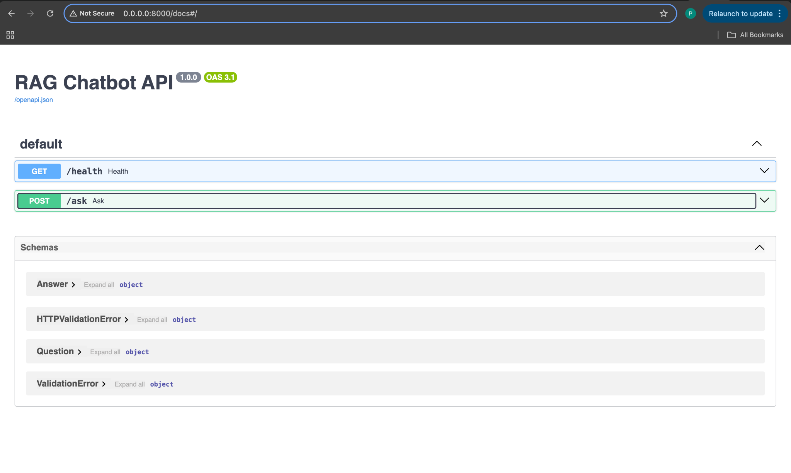

# 🧠 RAG Chatbot API (FastAPI + Docker)

A **Retrieval-Augmented Generation (RAG) Chatbot API** built with:
- **FastAPI** for serving endpoints
- **LangChain** for pipeline orchestration
- **HuggingFace Transformers** for free embeddings + LLMs
- **FAISS** for vector database
- **Docker** for containerization

---

## 🚀 Features
- `/health` → Health check endpoint
- `/ask` → Ask any question, chatbot retrieves context from PDF + generates an answer
- Uses HuggingFace `flan-t5-base` by default (no paid API needed!)
- Fully containerized with Docker

---

## 📂 Project Structure

Project_2/
├── app/                     # FastAPI application code
│   ├── __init__.py          # Makes app a package
│   ├── main.py              # API endpoints (health, ask)
│   └── rag_pipeline.py      # RAG pipeline (embeddings, vector store, QA chain)
├── artifacts/               # Stores FAISS vector database
│   ├── index.faiss
│   └── index.pkl
├── data/                    # Input documents (PDFs, etc.)
│   └── Attention.pdf
├── docs/                    # Documentation and assets
│   └── swagger.png          # Swagger UI screenshot
├── .env                     # Environment variables (API keys, configs)
├── Dockerfile               # Docker configuration
├── requirements.txt         # Python dependencies
├── run_me_once.py           # Script to build vector store
└── README.md                # Project documentation

